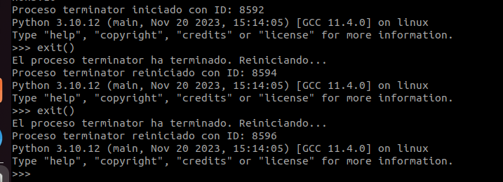
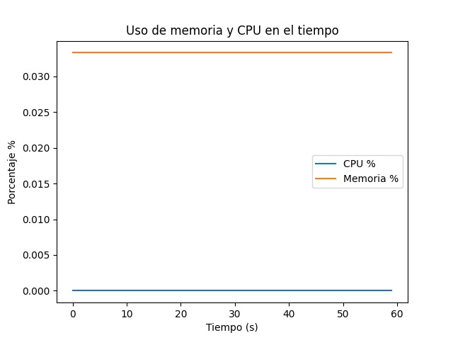

# Laboratorio 7 Programacion bajo plataformas abiertas
Bryan Cortés Espinola C22422
# Scripting y Procesos
---

1. En el primer enunciado del laboratorio se creó el script mostrado en el archivo `informacion_proceso.py` el cual tiene como funcion recibir un argumento el cual va a ser el Process ID, y este nos va a entregar informacion del proceso, como lo es el nombre, usuario propetario, consumo de memoria etc.
Para ello se creó la funcion *get_process_info()*, el cual utlizando el modulo de `psutil` se obtine la informacion solicitada y se muestra, un ejemplo de funcionamiento es el siguiente:
---
### uso
>  `python3 informacion_proceso.py <PID>`
---

2. En el segundo ejercicio  se realizó el script mostrado en `monitoreo_proceso.py` el cual mediante recibe dos argumentos los cuales son el nombre del proceso y el path del ejecutable, con esos argumentos se pasan a la funcion run_process() la cual ejecuta el proceso a monitorear usando el modulo `psutil` , y utilizando el modulo de `time` cada segundo se verifica si el status del proceso indica que se esté ejecutando, caso contrario se vuelve a levantar el proceso, como se muestra en la siguiente imagen:
---
### uso
>  `python3 informacion_proceso.py <nombre_proceso> <ejecutable>`
---

3. En el ultimo enunciado, se realizó el script mostrado en el archivo `consumo_proceso.py` el cual recibe de argumento un ejecutable de un proceso, el cual se en la funcion *monitor_process()* se ejecuta y se van tomando registro de los valores de CPU y memoria que estan utilizando cada segundo hasta que que se termine el tiepo de registro, el cual en este caso se puso a 60 segundos, estos valores son escritos en el archivo `registro.log` y luego utilizando matplotlib y con la funcion *plot_graph* se realiza un grafico de la memoria y CPU utilizados en el tiempo, el cual luce de la siguiente manera:

### uso
>  `python3 monitorea_proceso.py <ejecutable>`

---

